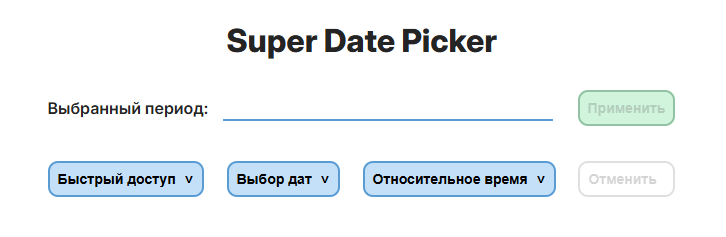
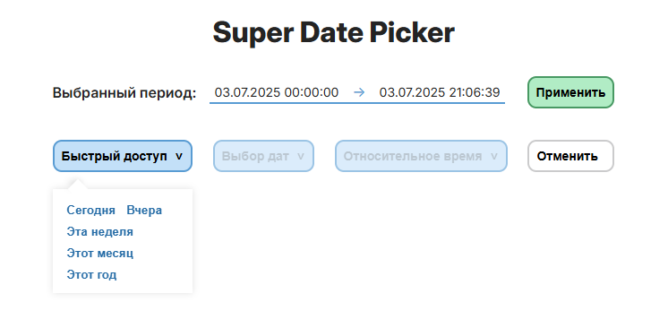
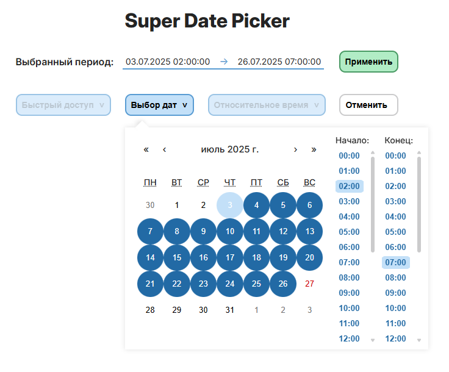
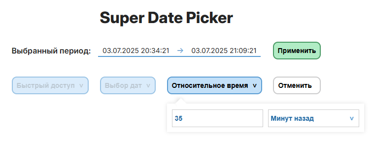

# Custom Super Data Picker

**Используемые технологии**

&nbsp;
&nbsp;
&nbsp;
&nbsp;

**Запуск проекта**

- Клонировать репозиторий `git clone`
- Установить зависимости `npm install`
- Собрать проект `npm run build`
- Запустить проект `npm preview`
